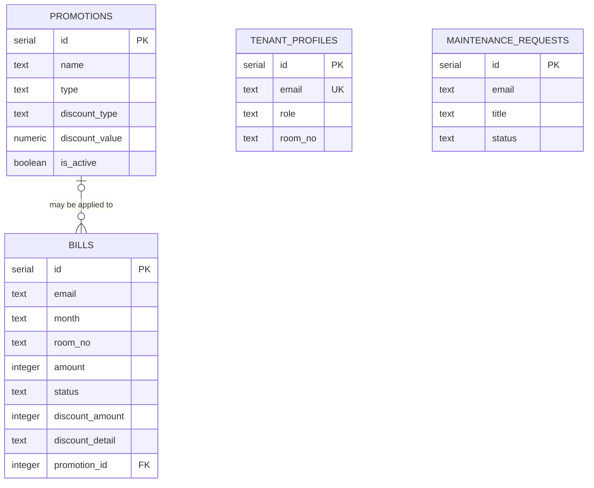

# ER Diagram

This diagram shows the entities and foreign key confirmed by the repository SQL in [`data/setup_database.sql`](../data/setup_database.sql). The diagram includes the principal columns; the complete column specification is in [`DATABASE-SCHEMA.md`](DATABASE-SCHEMA.md).

`bills.promotion_id` is nullable, so a bill can have no promotion or one promotion. A promotion can be referenced by zero or more bills. No FK is declared from either `bills.email` or `maintenance_requests.email` to `tenant_profiles.email`; those email references are application-level only in the checked SQL.

## Unverified References

Code also queries `rooms`, `occupied_rooms`, `announcements`, and `messages`. Their definitions are absent from the repository SQL, so they are marked **UNVERIFIED** and omitted as confirmed entities and relationships. See the schema document for fields observed in code and the unresolved embedded `tenant_profiles` query.
